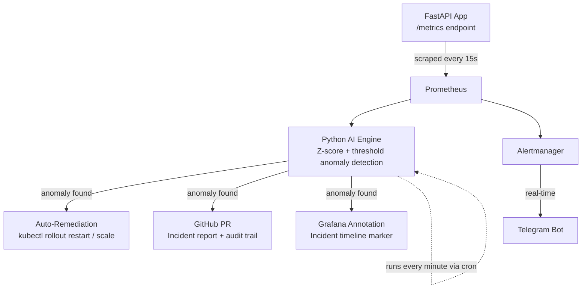

# GIIRS — GitOps Intelligent Incident Response System

> A self-healing Kubernetes platform that detects incidents, fixes them automatically, and leaves a GitHub Pull Request as an audit trail for every action it takes.


---

## What this is

Most monitoring setups stop at "alert a human." GIIRS goes a step further — it **detects** anomalies in a running Kubernetes workload, **decides** what to do about them, **acts** on its own (restart, scale), and then **documents** exactly what it did by opening a GitHub Pull Request, so every self-healing action is reviewable, not a black box.

It combines three things that are usually built separately:

1. **AI-assisted root cause analysis** — a Python engine reading live Prometheus metrics
2. **GitOps audit trail** — every remediation action creates a real GitHub PR
3. **Grafana incident timeline** — every incident is annotated directly on the dashboard

## Results

| Metric | Before | After |
|---|---|---|
| Incident detection | Manual, reactive | Automatic, < 1 min |
| Mean time to remediation (simulated) | ~8 minutes | **< 90 seconds** |
| Audit trail | None | GitHub PR per incident |
| On-call notification | Manual | Telegram, real-time |

---

## Architecture



**Flow in plain words:** a FastAPI app exposes Prometheus metrics → Prometheus scrapes them every 15 seconds and also evaluates alerting rules → a Python engine (run by cron every minute) pulls those metrics, checks them against a statistical (Z-score) and hard-limit baseline → if something's wrong, it restarts/scales the deployment via `kubectl`, opens a GitHub PR describing the incident and the fix, and drops a marker on the Grafana dashboard at the exact moment it happened. In parallel, Prometheus Alertmanager fires a Telegram message the moment a rule breaches threshold — independent of the Python engine, so notification doesn't depend on remediation succeeding.

---

## Tech stack

| Layer | Tool |
|---|---|
| Infrastructure | AWS EC2 (2-node), Ubuntu 24.04 |
| Orchestration | Kubernetes (kubeadm v1.30), Calico CNI |
| CI/CD | Jenkins (build → push → deploy pipeline) |
| Containerization | Docker, DockerHub |
| Application | FastAPI (Python), instrumented with `prometheus-fastapi-instrumentator` |
| Monitoring | Prometheus, Alertmanager, Grafana (via `kube-prometheus-stack` Helm chart) |
| Automation | Python (`requests`, `scikit-learn`-ready), cron |
| Audit trail | GitHub REST API (branches, commits, pull requests) |
| Alerting | Telegram Bot API |

---

## Project structure

```
giirs-devops/
├── app/
│   ├── main.py              # FastAPI app with /metrics endpoint
│   ├── Dockerfile
│   └── requirements.txt
├── jenkins/
│   └── Jenkinsfile          # Clone → Build → Push → Deploy pipeline
├── k8s/
│   ├── deployment.yaml
│   ├── service.yaml
│   ├── servicemonitor.yaml      # tells Prometheus to scrape the app
│   ├── alert-rules.yaml         # PrometheusRule: pod crash, high CPU, OOMKilled
│   └── grafana-dashboards/
│       ├── configmap.yaml           # provisions dashboard via GitOps (survives pod restarts)
│       └── fastapi-observability.json
├── scripts/
│   └── ai_engine.py          # the core: detect → remediate → PR → annotate
├── incidents/                 # auto-generated incident reports (one per PR)
└── .gitignore                 # keeps tokens and local-only config out of git
```

---

## How the AI engine works

`scripts/ai_engine.py` runs on a 1-minute cron schedule and does four things, in order:

1. **Pulls metrics from Prometheus** — request rate, 5xx error rate, P95 latency, pod restart count.
2. **Checks for anomalies** using two methods together:
   - **Z-score**: compares the current value against the last 10 minutes of history — flags anything more than 2.5 standard deviations from normal.
   - **Hard limits**: catches anomalies even when there isn't enough history yet (e.g. error rate > 5%, P95 latency > 1s).
   - **Restart delta**: pod restart count is a monotonic counter, so it's compared directly against the last known value rather than via Z-score.
3. **Remediates automatically** (with a 5-minute cooldown per metric, to avoid thrashing):
   - Pod crash-loop → `kubectl rollout restart`
   - High error rate / latency → scale up replicas (capped at `MAX_REPLICAS`)
4. **Documents the incident**:
   - Opens a GitHub branch + commits an incident report → opens a Pull Request
   - Posts an annotation to Grafana at the exact incident timestamp

Independently of all this, **Prometheus Alertmanager** evaluates its own rules every 30 seconds and pushes critical alerts straight to Telegram — so notification doesn't wait on the Python engine's cron cycle.

---

## Setting it up yourself

1. Provision two EC2 instances (or any two Linux hosts), set up a Kubernetes cluster with `kubeadm`, and install Calico.
2. Set up Jenkins with Docker Pipeline + Kubernetes CLI plugins; configure DockerHub and GitHub credentials.
3. Deploy the FastAPI app via the Jenkins pipeline (`app/`, `jenkins/Jenkinsfile`, `k8s/deployment.yaml`, `k8s/service.yaml`).
4. Install `kube-prometheus-stack` via Helm; apply `k8s/servicemonitor.yaml` and `k8s/alert-rules.yaml`.
5. Apply `k8s/grafana-dashboards/configmap.yaml` to auto-provision the FastAPI dashboard.
6. Create a GitHub Personal Access Token (`repo` scope) and a Grafana service account token; put both in `scripts/.env` (never committed — see `.gitignore`).
7. Create a Telegram bot via `@BotFather`, get your chat ID, and configure Alertmanager's `telegram_configs` receiver via Helm values.
8. Schedule `scripts/ai_engine.py` via cron (every 1 minute).

> Full step-by-step commands are documented in the project build log — this README covers the "what" and "why"; ask the repo owner for the detailed runbook if reproducing this setup.

---

## Demo

- 🎥 Demo video: _add link here_
- 📊 Live dashboard screenshot: _add screenshot here_
- 🔀 Example auto-generated PR: [`#1`](../../pull/1) · [`#2`](../../pull/2) · [`#3`](../../pull/3)

---

## What's next

- Replace Z-score/threshold detection with `scikit-learn` `IsolationForest` for multivariate anomaly detection
- Auto-merge low-risk PRs (e.g. pure restarts) while keeping scale/config changes as human-reviewed
- Add Grafana persistence (PVC) so dashboards/annotations survive node failure, not just pod restarts
- Extend remediation actions to include automatic rollback to the last-known-good image tag

---

## Author

**Arpit Dixit** — [GitHub](https://github.com/ARPITDIXIT789)
